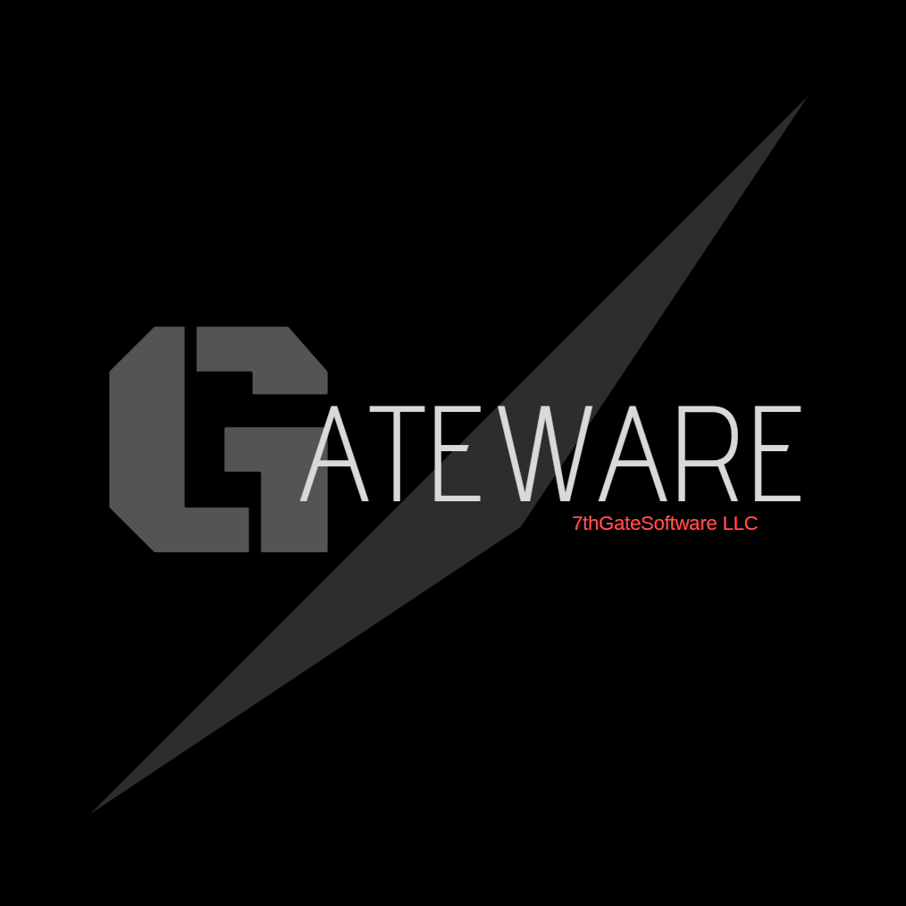

## What is Gateware?
* Gateware is an opensource C++ single header platform abstraction library for graphics, sound, input and more!
* The project was started to support programmers interested in developing 3D games/software from the ground up. 
* It is designed to be as easy as possible to deploy to new and existing projects. (Minimal dependencies)
* It is modular, you only compile the specific libraries you want by **#define**ing their namespaces.
* It targets streamlined functionality with interfaces that manage their own memory.
	* *For Example:* play sounds, open a window, get user input, connect DirectX12 to said window.
## Who could benefit from its use?
* 2D/3D Game/Engine Programmers looking for a simplistic multi-platform library for Input/Graphics/Audio.
* People learning C++ who want to dip their toes into real-time 2D/3D graphics.
	* Gateware can initialize: OpenGL, Vulkan, Direct3D11/12 and even raw pixel graphics for you.
* Programmers who need a straightforward input/audio/etc.. library **right now** with minimal time/effort.
* Fans of opensource projects looking for a new C++11 library to play with and/or contribute to.
* University professors looking for a platform agnostic way to teach low-level programming skills.  
## Who may want to skip it?
* Programmers who need the most feature rich/complex API available for a specific task.
* Game developers looking for a all-in-one game engine/editor. (Gateware is middleware)
* Productions looking for a proven commercial product with paid support available.
* Developers already satisfied using similar projects like: SDL, SFML, GLFW etc..
* Programmers who want a 99% mature library that only has occasional maintenance fixes.
	* We develop using TDD and get more stable every year, but its not totally rock-solid yet.  
## What platforms are supported?
* **Currently Supported:**
	* *Desktop -* Win32 (x64), MacOS (Intel), Linux (amd64)
* **In Development:**
	* *Console/Mobile -* UWP/XBox One/Series (x64), iOS (ARM)
* **Planned:**
	* *Mobile -* Android (ARM), Nintendo Switch (ARM)
## What features are available?
* This is not an exhaustive list, but should cover most of what you would use Gateware for:
	* Getting user input from keyboard and mouse as well as various game controllers.
	* Loading and playing audio files for both music streaming and sound effects.
	* Creating a platform-agnostic window and attaching a 2D/3D Graphics API to it.
	* Doing various common linear algebra computations: Vector/Matrix/Quaternion.
	* Detecting 2D and 3D collissions between various types of shapes/volumes.
	* UTF-8 File I/O, Error Logging, Thread/Task Managment/Scheduling.
* There is more planned, but the focus for now is more on bug-fixes/stability/porting.
## Where do I download?
* Just clone/download the contents of this repository from our master branch or go to the [Releases](https://gitlab.com/gateware-development/gateware/-/releases) page.
* The API itself is **Gateware.h**, our README should run you through the basics of how to use Gateware.
* Full documentation is generated and shipped with each release: **documentation/html/index.html** 
* If you are interested in contributing to the project, you will want to visit the [GSource](https://gitlab.com/gateware-development/gsource) repository.
* If you want to get started quickly, I suggest visiting the [GTemplates](https://gitlab.com/gateware-development/gtemplates) repository.

 
